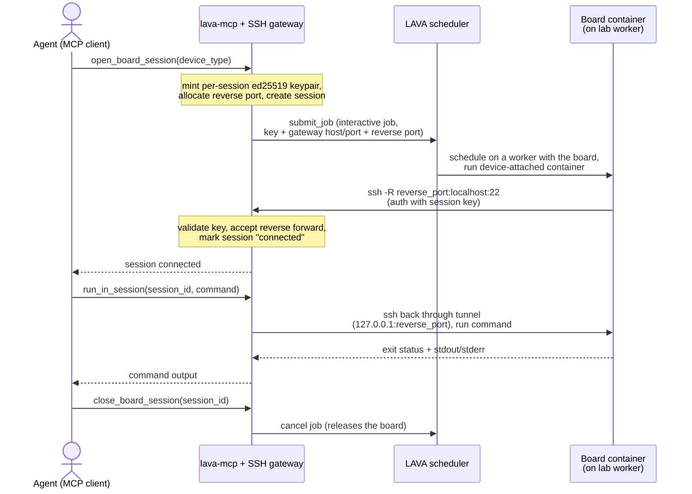
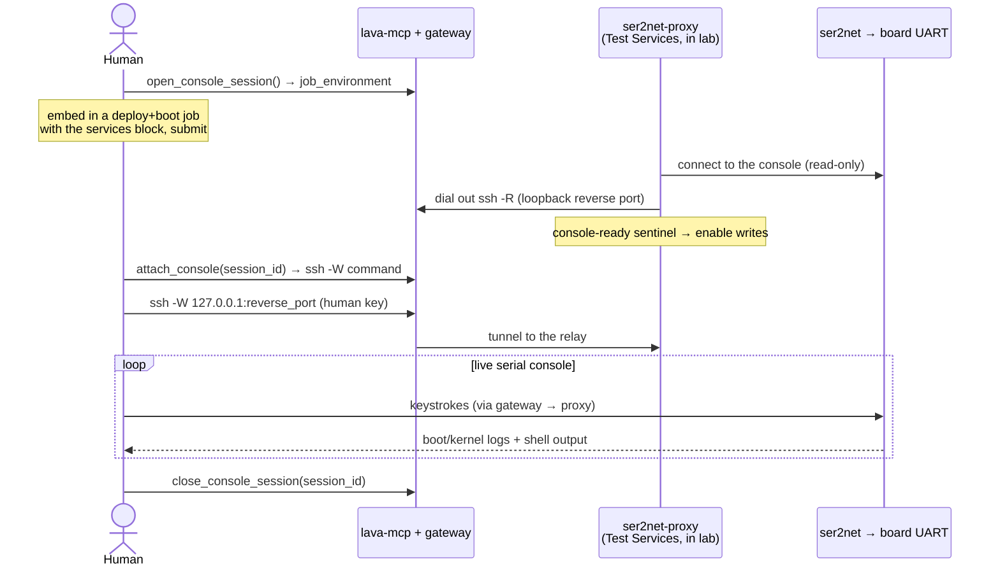

# lava-mcp

An [MCP](https://modelcontextprotocol.io) server that exposes a
[LAVA](https://www.lavasoftware.org/) instance to agents — letting them query the
board farm, submit and manage test jobs, and (in a later phase) open interactive
sessions to a board.

It is a thin client over LAVA's REST API (v0.2/v0.3); point it at any LAVA instance.

## Install

```sh
pip install -e .[dev]
```

## Credentials

The LAVA **target** (`LAVA_URL`) is normally pinned to the instance a deployment
fronts; the **token** is resolved per request:

- **Hosted (HTTP), pinned** — set `LAVA_URL` on the server to the LAVA instance it
  serves. Each connecting client then sends only its own `X-Lava-Token` and acts as
  its own LAVA user; no `X-Lava-Url` is needed. The server stores no per-user token.
- **Hosted (HTTP), multi-tenant** — leave `LAVA_URL` unset; each client sends both
  `X-Lava-Url` and `X-Lava-Token`, so one server can front many LAVA instances.
- **Local (stdio) mode** — falls back to `LAVA_URL` / `LAVA_TOKEN` in the
  environment (single user).

## Run (stdio, local)

```sh
export LAVA_URL=https://lava.example.com
export LAVA_TOKEN=<your-api-token>
lava-mcp                                  # or: lava-mcp --read-only
```

Launch over stdio from your MCP client (`claude_desktop_config.json` / Claude Code):

```json
{
  "mcpServers": {
    "lava": {
      "command": "lava-mcp",
      "env": { "LAVA_URL": "https://lava.example.com", "LAVA_TOKEN": "..." }
    }
  }
}
```

For a hosted server pinned to a LAVA instance, point Claude Code at the HTTP
endpoint and pass only your token:

```sh
claude mcp add --transport http lava https://mcp.example.com/mcp \
  --header "X-Lava-Token: <your-api-token>"
```

If the server is multi-tenant (no `LAVA_URL` set), also pass
`--header "X-Lava-Url: https://lava.example.com"` to choose the instance.

## Run as a hosted service (HTTPS via Caddy)

For interactive board sessions the server must be reachable by lab workers, so run
it hosted. `docker compose` brings up the MCP server behind Caddy (automatic HTTPS)
and exposes the SSH board-session gateway:

```sh
cp .env.example .env      # set LAVA_URL/LAVA_TOKEN/LAVA_MCP_DOMAIN/LAVA_MCP_GATEWAY_HOST
docker compose up -d
```

- Agents connect to `https://$LAVA_MCP_DOMAIN/mcp` (streamable-HTTP transport).
- In-job containers dial the SSH gateway at `$LAVA_MCP_GATEWAY_HOST:2222`.

Or run the HTTP transport directly:

```sh
lava-mcp --transport streamable-http --host 0.0.0.0 --port 8000 --gateway
```

## Interactive board sessions (gateway)

In hosted mode with `--gateway` (or `LAVA_MCP_GATEWAY_ENABLED=true`), the server runs
an in-process SSH rendezvous. `open_board_session` submits a LAVA job that runs a
device-attached container; the container dials **out** (`ssh -R`) to the gateway, so
no inbound access to the worker is needed.



Then:

- `run_in_session(session_id, command)` runs a command on the board's container
  (e.g. `qdl`, `fastboot`, `adb`, shell).
- `close_board_session(session_id)` cancels the job and frees the board.

The container image + test definition live in this repo under `interactive/`
(published to `ghcr.io/mattface/lava-mcp/interactive` and fetched from this repo by
the lab worker); the parameter contract is in `lava_mcp/jobs.py`.

Optional allowlists gate the interactive features (all default to open). The general
LAVA-proxy tools are **never** gated here — they are equivalent to using your own LAVA
token, so `/mcp` is usable by any token holder.

- `LAVA_MCP_GATEWAY_ALLOW_IPS` — comma/space-separated IPs or CIDRs permitted to
  connect to the SSH gateway on `:2222`. It applies to **every** connection — in-job
  containers and humans alike — dropped before authentication. Set it to your lab worker
  network plus any human/VPN source ranges.
- `LAVA_MCP_HTTP_ALLOW_USERS` — LAVA users (via `whoami`) allowed the interactive *use*
  tools: `open_board_session`, `run_in_session`, `close_*`, `list_*`,
  `open_console_session`, `check_serial_console_support`.
- `LAVA_MCP_SSH_ALLOW_USERS` — users allowed the *attach* tools that hand out gateway/SSH
  keys: `attach_shell`, `attach_console`.

Interactive sessions are also gated **per device**: they only run on devices an admin
has opted in by tagging with `allow-remote-access` (override the tag name with
`LAVA_MCP_REMOTE_ACCESS_TAG`; set it empty to disable the gate). `open_board_session`
checks up front that the device-type has at least one such device and fails with an
actionable message if not, and every interactive job is pinned to the tag so LAVA only
schedules it on a permitted device.

The gateway tunnels into an isolated lab network, so its trust model matters — see
[docs/security.md](docs/security.md) for the roles, enforced controls (loopback-only
reverse tunnels, per-session keys, ephemeral human keys, session ownership), and the
operator responsibilities (set `LAVA_MCP_GATEWAY_ALLOW_IPS`, expose only 2222).

### For humans (without an agent)

The gateway has no dedicated human client — but the board-session tools are just MCP
calls, so a person can drive the exact same open → run → close flow by hand. Point any
generic MCP client at the hosted endpoint with your token; no LLM is involved.

The quickest is the [MCP Inspector](https://github.com/modelcontextprotocol/inspector):

```sh
npx @modelcontextprotocol/inspector
# In the UI: Transport = Streamable HTTP
#            URL       = https://<LAVA_MCP_DOMAIN>/mcp
#            Header    = X-Lava-Token: <your-api-token>
# (add X-Lava-Url too if the server is multi-tenant)
```

Then invoke the same tools the agent would:

1. `open_board_session` with `device_type` (e.g. `qcs6490-rb3gen2-core-kit`) — reserves
   a board, submits the LAVA job, and waits for the container to dial back. The result
   includes the `session_id` and `connected: true`.
2. `run_in_session` with that `session_id` and a `command` (`qdl`, `fastboot`, `adb`,
   any shell) — returns the exit status, stdout and stderr.
3. `close_board_session` with the `session_id` — cancels the job and frees the board.

This is command-at-a-time execution over the gateway, not a live PTY.

### Interactive SSH shell for humans (`attach_shell`)

For a live PTY on the board — not command-at-a-time — call `attach_shell(session_id)`.
It mints a short-lived keypair, authorises it **both** at the gateway (for the tunnel)
and inside the board container (appended to its `authorized_keys` over the existing
session), and returns a ready-to-run `ssh` command. You `ProxyJump` through the gateway
straight into the container's own sshd — the gateway forwards but offers no shell of its
own, and the container's key is never disclosed:

```sh
# save private_key to lava-shell-<id>.key (chmod 600), then:
ssh -i lava-shell-<id>.key \
  -o ProxyJump=<session_id>@<gateway-host>:2222 \
  -p <reverse_port> root@127.0.0.1
```

```mermaid
sequenceDiagram
    actor Human
    participant MCP as lava-mcp + SSH gateway
    participant Board as Board container<br/>(reverse tunnel up, runs sshd)

    Human->>MCP: attach_shell(session_id)
    Note over MCP: mint ephemeral human key; authorise it<br/>at the gateway AND in the container
    MCP->>Board: append human key to authorized_keys<br/>(over the session)
    MCP-->>Human: private key + ssh (ProxyJump) command

    Human->>MCP: ssh -J session@gateway (human key)
    Note over MCP: human role — allow direct-tcpip to<br/>127.0.0.1:reverse_port only
    MCP->>Board: tunnel to the container sshd
    Human->>Board: authenticate as root (human key) → PTY
    loop live interactive shell
        Human->>Board: keystrokes (via gateway tunnel)
        Board-->>Human: terminal output (via gateway tunnel)
    end

    Human->>MCP: close_board_session(session_id)
    Note over MCP: revoke human key; cancel job (container destroyed)
```

Human keys expire (`LAVA_MCP_GATEWAY_HUMAN_KEY_TTL`, default 1h) and are revoked on
`close_board_session`. Your source IP must be inside `LAVA_MCP_GATEWAY_ALLOW_IPS` if set.
See [docs/security.md](docs/security.md) for the full model.

### Direct serial console via ser2net (`open_console_session` / `attach_console`)

Where `attach_shell` gives you the board's *userspace* (it needs a booted, networked
board), a **serial console** is the board's actual UART — boot/kernel/panic logs, works
with no DUT networking, and the login prompt itself. Many LAVA labs front the UART with
[ser2net](https://github.com/cminyard/ser2net) (the device dict's `connection_command`
is `telnet <ser2net-host> <port>`), and LAVA drives boot over that same console. This is
**Mode 2** — used with a LAVA job that deploys and boots an image and runs its test *on
the board* (no device-attached container), so the in-lab foothold comes from a **LAVA
Test Services** container (`interactive/ser2net-proxy/`) instead. It needs
`allow_test_services: true` in the device dict (check with `check_serial_console_support`).

Flow:

1. `open_console_session()` mints a session and returns a `job_environment` block. Add it
   to your deploy-and-boot job's top-level `environment:`, include the
   `interactive/ser2net-proxy` **services** block, and set the `SER2NET_*` vars for your
   lab. Submit the job.
2. The proxy starts at the beginning of the job, relays the console **read-only** while
   LAVA drives the boot, and dials **out** (`ssh -R`) to the gateway. When your
   console-ready test echoes the sentinel (`LAVA_MCP_CONSOLE_WRITABLE`), the proxy
   enables writes.
3. `attach_console(session_id)` returns an `ssh -W` command (wrap with `socat` for a raw
   PTY) — you get the live UART, bridged through the gateway on a loopback-only port.
4. `close_console_session(session_id)` revokes access; ending the job tears down the proxy.



**Console handoff** wrinkle: ser2net must allow the proxy's concurrent connection (or the
job idles after boot so LAVA releases the console). Confirmed working on staging. A ready
test job is in `interactive/ser2net-proxy/test-job-qcs615.yaml`.

## Configuration

| Env var | CLI flag | Meaning |
|---|---|---|
| `LAVA_URL` | `--url` | LAVA base URL (stdio fallback; HTTP clients send `X-Lava-Url`) |
| `LAVA_TOKEN` | `--token` | API token (stdio fallback; HTTP clients send `X-Lava-Token`) |
| `LAVA_API_VERSION` | `--api-version` | REST version, default `v0.3` |
| `LAVA_MCP_READ_ONLY` | `--read-only` | Hide write tools (submit/cancel/resubmit) |
| `LAVA_MCP_TRANSPORT` | `--transport` | `stdio` (default) or `streamable-http` |
| `LAVA_MCP_HOST` / `LAVA_MCP_PORT` | `--host` / `--port` | HTTP bind (hosted mode) |
| `LAVA_MCP_GATEWAY_ENABLED` | `--gateway` | Enable interactive SSH board-session gateway |
| `LAVA_MCP_GATEWAY_PORT` | `--gateway-port` | SSH gateway port (default 2222) |
| `LAVA_MCP_GATEWAY_ADVERTISE_HOST` | `--gateway-advertise-host` | Host containers dial back to |
| `LAVA_MCP_GATEWAY_WS_URL` | `--gateway-ws-url` | Advertised `wss://host/gateway-ssh` URL; carries the gateway SSH over WebSocket/TLS via Caddy (requires `websocat` on clients). Empty = direct dial |
| `LAVA_MCP_GATEWAY_WS_PORT` | — | Bridge listen port Caddy proxies `/gateway-ssh` to (default 8022) |
| `LAVA_MCP_GATEWAY_ALLOW_IPS` | `--gateway-allow-ip` | Source IPs/CIDRs allowed to reach the SSH gateway (empty = all) |
| `LAVA_MCP_HTTP_ALLOW_USERS` | `--http-allow-user` | LAVA users allowed the interactive 'use' tools (empty = all) |
| `LAVA_MCP_SSH_ALLOW_USERS` | `--ssh-allow-user` | LAVA users allowed the 'attach' (SSH/console) tools (empty = all) |
| `LAVA_MCP_REMOTE_ACCESS_TAG` | `--remote-access-tag` | Device tag required to host remote-access sessions (empty = no gate) |
| `LAVA_MCP_GATEWAY_HUMAN_KEY_TTL` | — | Lifetime (seconds) of an ephemeral human access key from `attach_*` (default 3600) |

## Tools (v1)

Read/observe: `whoami`, `version`, `list_devices`, `get_device`,
`get_device_dictionary`, `list_device_types`, `list_workers`, `list_jobs`,
`get_job`, `get_job_definition`, `get_job_logs`, `get_job_results`, `get_queue`,
`get_running`, `get_lab_health`, `validate_job`.

Write (omitted with `--read-only`): `submit_job`, `cancel_job`, `resubmit_job`.

Interactive board sessions (hosted gateway mode): `open_board_session`,
`run_in_session`, `attach_shell`, `close_board_session`, `list_board_sessions`.

Serial console (hosted gateway mode): `check_serial_console_support`,
`open_console_session`, `attach_console`, `close_console_session`.

## Test

```sh
pytest
```

## Roadmap

- The interactive **board sessions** gateway is implemented here, along with the
  container image + test definition the in-job container runs (`interactive/`,
  published to `ghcr.io/mattface/lava-mcp/interactive`).
- Human shell proxy + interactive PTY through the gateway (design above).
- Direct serial console for humans via ser2net, gated on a `console-ready` job signal
  (design above).
