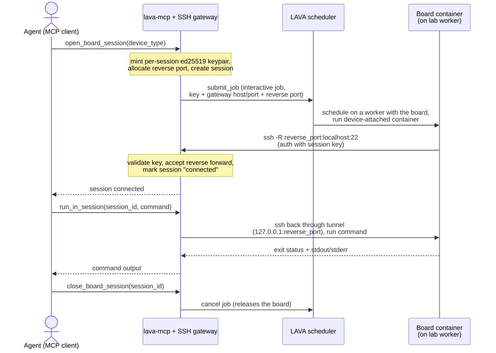

# lava-mcp

An [MCP](https://modelcontextprotocol.io) server that exposes a
[LAVA](https://www.lavasoftware.org/) instance to agents — letting them query the
board farm, submit and manage test jobs, and (in a later phase) open interactive
sessions to a board.

It is a thin client over LAVA's REST API (v0.2/v0.3); point it at any LAVA instance.

## Install

```sh
pip install -e .[dev]
```

## Credentials

The LAVA **target** (`LAVA_URL`) is normally pinned to the instance a deployment
fronts; the **token** is resolved per request:

- **Hosted (HTTP), pinned** — set `LAVA_URL` on the server to the LAVA instance it
  serves. Each connecting client then sends only its own `X-Lava-Token` and acts as
  its own LAVA user; no `X-Lava-Url` is needed. The server stores no per-user token.
- **Hosted (HTTP), multi-tenant** — leave `LAVA_URL` unset; each client sends both
  `X-Lava-Url` and `X-Lava-Token`, so one server can front many LAVA instances.
- **Local (stdio) mode** — falls back to `LAVA_URL` / `LAVA_TOKEN` in the
  environment (single user).

## Run (stdio, local)

```sh
export LAVA_URL=https://lava.example.com
export LAVA_TOKEN=<your-api-token>
lava-mcp                                  # or: lava-mcp --read-only
```

Launch over stdio from your MCP client (`claude_desktop_config.json` / Claude Code):

```json
{
  "mcpServers": {
    "lava": {
      "command": "lava-mcp",
      "env": { "LAVA_URL": "https://lava.example.com", "LAVA_TOKEN": "..." }
    }
  }
}
```

For a hosted server pinned to a LAVA instance, point Claude Code at the HTTP
endpoint and pass only your token:

```sh
claude mcp add --transport http lava https://mcp.example.com/mcp \
  --header "X-Lava-Token: <your-api-token>"
```

If the server is multi-tenant (no `LAVA_URL` set), also pass
`--header "X-Lava-Url: https://lava.example.com"` to choose the instance.

## Run as a hosted service (HTTPS via Caddy)

For interactive board sessions the server must be reachable by lab workers, so run
it hosted. `docker compose` brings up the MCP server behind Caddy (automatic HTTPS)
and exposes the SSH board-session gateway:

```sh
cp .env.example .env      # set LAVA_URL/LAVA_TOKEN/LAVA_MCP_DOMAIN/LAVA_MCP_GATEWAY_HOST
docker compose up -d
```

- Agents connect to `https://$LAVA_MCP_DOMAIN/mcp` (streamable-HTTP transport).
- In-job containers dial the SSH gateway at `$LAVA_MCP_GATEWAY_HOST:2222`.

Or run the HTTP transport directly:

```sh
lava-mcp --transport streamable-http --host 0.0.0.0 --port 8000 --gateway
```

## Interactive board sessions (gateway)

In hosted mode with `--gateway` (or `LAVA_MCP_GATEWAY_ENABLED=true`), the server runs
an in-process SSH rendezvous. `open_board_session` submits a LAVA job that runs a
device-attached container; the container dials **out** (`ssh -R`) to the gateway, so
no inbound access to the worker is needed.



Then:

- `run_in_session(session_id, command)` runs a command on the board's container
  (e.g. `qdl`, `fastboot`, `adb`, shell).
- `close_board_session(session_id)` cancels the job and frees the board.

The container image + test definition live in this repo under `interactive/`
(published to `ghcr.io/mattface/lava-mcp/interactive` and fetched from this repo by
the lab worker); the parameter contract is in `lava_mcp/jobs.py`.

### For humans (without an agent)

The gateway has no dedicated human client — but the board-session tools are just MCP
calls, so a person can drive the exact same open → run → close flow by hand. Point any
generic MCP client at the hosted endpoint with your token; no LLM is involved.

The quickest is the [MCP Inspector](https://github.com/modelcontextprotocol/inspector):

```sh
npx @modelcontextprotocol/inspector
# In the UI: Transport = Streamable HTTP
#            URL       = https://<LAVA_MCP_DOMAIN>/mcp
#            Header    = X-Lava-Token: <your-api-token>
# (add X-Lava-Url too if the server is multi-tenant)
```

Then invoke the same tools the agent would:

1. `open_board_session` with `device_type` (e.g. `qcs6490-rb3gen2-core-kit`) — reserves
   a board, submits the LAVA job, and waits for the container to dial back. The result
   includes the `session_id` and `connected: true`.
2. `run_in_session` with that `session_id` and a `command` (`qdl`, `fastboot`, `adb`,
   any shell) — returns the exit status, stdout and stderr.
3. `close_board_session` with the `session_id` — cancels the job and frees the board.

This is command-at-a-time execution over the gateway, not a live PTY.

### Interactive SSH shell for humans (planned)

> **Not yet implemented** — this is the design for a real interactive shell over the
> same gateway. The tool and flags below don't exist yet; tracked on the
> [roadmap](#roadmap).

The plan is for the gateway to double as an **SSH bastion** so a person gets a live PTY
on the board without an agent and without ever seeing the container's private key. It
reuses the one listener already published on `:2222`, telling the two callers apart by
key and channel:

- the **container** authenticates with its per-session key and may only request the
  reverse forward (as it does today);
- a **human** authenticates with a short-lived, per-session key and may only open a
  shell — which the gateway bridges into the board over the existing reverse tunnel,
  doing the inner hop with the container key itself.

A person would open a session (`open_board_session`), then call a new
`attach_session(session_id)` tool. That mints an ephemeral keypair, authorizes it for
the session, and returns the private key plus a ready-to-run command over the
already-authenticated MCP/HTTPS channel — the container key never leaves the server.
One line then drops you into the board shell:

```sh
ssh -i lava-session-<id> -p 2222 <session_id>@<gateway-host>
```

Human keys are per-session and revoked on `close_board_session`; the whole path sits
behind a `LAVA_MCP_GATEWAY_HUMAN_ENABLED` flag.

## Configuration

| Env var | CLI flag | Meaning |
|---|---|---|
| `LAVA_URL` | `--url` | LAVA base URL (stdio fallback; HTTP clients send `X-Lava-Url`) |
| `LAVA_TOKEN` | `--token` | API token (stdio fallback; HTTP clients send `X-Lava-Token`) |
| `LAVA_API_VERSION` | `--api-version` | REST version, default `v0.3` |
| `LAVA_MCP_READ_ONLY` | `--read-only` | Hide write tools (submit/cancel/resubmit) |
| `LAVA_MCP_TRANSPORT` | `--transport` | `stdio` (default) or `streamable-http` |
| `LAVA_MCP_HOST` / `LAVA_MCP_PORT` | `--host` / `--port` | HTTP bind (hosted mode) |
| `LAVA_MCP_GATEWAY_ENABLED` | `--gateway` | Enable interactive SSH board-session gateway |
| `LAVA_MCP_GATEWAY_PORT` | `--gateway-port` | SSH gateway port (default 2222) |
| `LAVA_MCP_GATEWAY_ADVERTISE_HOST` | `--gateway-advertise-host` | Host containers dial back to |

## Tools (v1)

Read/observe: `whoami`, `version`, `list_devices`, `get_device`,
`get_device_dictionary`, `list_device_types`, `list_workers`, `list_jobs`,
`get_job`, `get_job_definition`, `get_job_logs`, `get_job_results`, `get_queue`,
`get_running`, `get_lab_health`, `validate_job`.

Write (omitted with `--read-only`): `submit_job`, `cancel_job`, `resubmit_job`.

Interactive board sessions (hosted gateway mode): `open_board_session`,
`run_in_session`, `close_board_session`, `list_board_sessions`.

## Test

```sh
pytest
```

## Roadmap

- The interactive **board sessions** gateway is implemented here, along with the
  container image + test definition the in-job container runs (`interactive/`,
  published to `ghcr.io/mattface/lava-mcp/interactive`).
- Human shell proxy + interactive PTY through the gateway.
